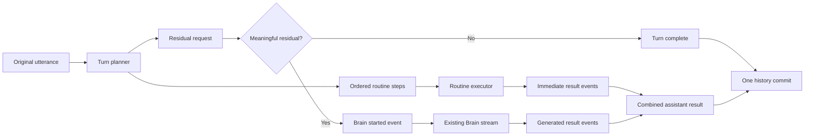

# Compound-turn orchestration design

## Source of truth

- **Status:** Proposed
- **Last refreshed:** 2026-08-15
- **Primary product surfaces:** browser wake-word chat, `/chat`, instant routines,
  Brain generation, stage cues, browser/robot thinking sounds, conversation history
- **Decision:** answer every confidently recognized local subrequest immediately;
  invoke the Brain and show thinking/generation feedback only when meaningful
  unresolved work remains.
- **Evidence reviewed:**
  - `CONTEXT.md` — Routine layer, Brain, stage cue, soundbyte, and Body vocabulary
  - `DESIGN.md` — as-built head/body/Brain architecture and latency goals
  - `README.md` — dependency policy and public behavior
  - `static/console.html` — wake-word capture, pending state, thinking UI/audio
  - `bmo_web.py` — `/chat`, `chat_turn`, and streamed Brain-to-speech path
  - `neatobmo/routines.py` — routine registry and first-match behavior
  - `neatobmo/brain.py` — history ownership and sentence streaming
  - `neatobmo/speech.py` — speech jobs and robot thinking sounds
  - `neatobmo/cues.py` — stage-cue parsing and the shared `BurstBudget`
  - `tests/test_routines.py`, `tests/test_orchestrator.py`, and
    `tests/test_tts_controller.py` — current behavioral seams and gaps

This document is the implementation contract for compound conversation turns.
The broader system design remains in `DESIGN.md`.

## Executive summary

The current Routine layer answers quickly because it is tried before the slow
Brain. Its matcher searches the entire utterance and returns the first routine
whose trigger appears anywhere. `chat_turn` then treats that routine as the
answer to the entire turn and does not call the Brain. Consequently, a full
transcript such as:

> What time is it and why is the sky blue?

produces only the time answer. The wake-word and transcription path is not
required to reproduce the failure.

The correction is not to disable routines or make their patterns exact-only.
That would preserve correctness by sacrificing the product's best latency
feature. The correction is to introduce a **Turn planner** between input and
execution:

1. conservatively divide the utterance into request parts;
2. resolve every fully understood part through the existing Routine layer;
3. preserve every unhandled or ambiguous part as the **Residual request**;
4. emit and perform routine results immediately, in source order;
5. start thinking feedback and Brain generation only when the Residual request
   contains meaningful work; and
6. commit one coherent user/assistant pair to Brain history after the turn.

No general-purpose NLP framework, frontend framework, WebSocket stack, or ASGI
migration is justified for this change. The finite routine vocabulary remains a
rule-based problem, while browser-native Fetch response streams can carry
incremental events over the existing POST request.

## Problem and root cause

### Observed behavior

The failure is deterministic at the server seam:

| Input | Current result | Brain called? |
| --- | --- | --- |
| `what time is it?` | Time routine | No; correct fast path |
| `what time is it and why is the sky blue?` | Time routine only | No; residual lost |
| `what time is it and dance` | Dance routine only | No; registry order wins |
| `please explain gravity and what time is it` | Time routine only | No; residual lost |
| `what is the meaning of life?` | Brain answer | Yes |

The test suite passes because it covers isolated routine hits, isolated misses,
and follow-up state, but not compound turns or residual preservation.

### Root cause chain

1. `routines.match()` normalizes the complete utterance.
2. It iterates `ROUTINES` in registry order and uses `re.search()`.
3. It returns immediately on the first matching trigger.
4. `chat_turn()` interprets any `Hit` as ownership of the complete turn.
5. The complete original text and canned routine reply are stored in history as
   though every part was answered.

This creates three defects:

- **silent loss:** unmatched clauses never reach the Brain;
- **order dependence:** registry order, not spoken order, chooses the result;
- **incorrect memory:** history says BMO answered content it ignored.

### Adjacent UX defect

The browser currently enters `thinking` state and starts thinking audio before
the server has classified the turn. A routine-only request therefore looks like
an LLM request even though the Brain is never used. The browser audio loop also
requests `/thinking-sound`, but `bmo_web.py` has no route serving that resource;
the WAV assets do exist under `assets/bmo-thinking-sounds/`.

## Brand

- **Personality:** quick, playful, and transparent; BMO reacts immediately when
  BMO knows something locally and visibly keeps working when more remains.
- **Trust signals:** never imply the complete request is answered when only one
  part is complete; never hide dropped or failed residual work.
- **Avoid:** technical phrases such as “LLM inference,” a noisy thinking loop for
  instant turns, repeated answers, or a second user-visible conversation turn
  for the residual.
- **Microcopy:** use “BMO knows this part!” only if a spoken acknowledgement is
  needed. The default visual status is `Thinking about the rest…`; once content
  begins, use `Answering the rest…`.

## Content voice

- **Tone:** tiny, direct, and warm; status language explains the state without
  breaking the BMO persona.
- **Terminology:** user-facing copy says `this part` and `the rest`; internal
  diagnostics use Routine step, Residual request, and Brain.
- **Microcopy rule:** do not claim completion until `turn_completed`, and do not
  expose implementation terms such as parser, residual, model, or event stream
  in the normal chat transcript.

## Product goals

### Goals

- Preserve the existing near-instant Routine experience.
- Execute multiple local subrequests in the order the user said them.
- Never silently discard meaningful text.
- Call the Brain only for unresolved work.
- Start thinking UI/audio only when the Brain is required.
- Present immediate and generated results as one coherent turn.
- Preserve one coherent history entry for the original user request and the
  combined assistant result.
- Reuse current Routine, Brain streaming, cue, Body, voice, and thinking-sound
  seams.

### Non-goals

- General natural-language understanding or arbitrary semantic planning.
- Moving wake-word or speech recognition onto the ESP32.
- Changing the BMO persona, cue vocabulary, or soundbyte policy.
- Introducing simultaneous user turns; the console remains single-turn-at-a-time.
- Migrating the stdlib HTTP server or vanilla-JavaScript frontend solely for this
  feature.
- Making destructive or long-running robot actions parallel.

### Success signals

- `what time is it?` emits no Brain/thinking event.
- `what time is it and check your battery` executes both local routines and
  emits no Brain/thinking event.
- `what time is it and why is the sky blue?` emits the time result first, then a
  Brain-started event, then the generated residual answer.
- Ambiguous text is escalated to the Brain rather than deleted.
- Exactly one user message and one combined assistant message enter history.
- The existing isolated-routine and Brain-only behavior remains compatible.

## Personas and jobs

- **Primary user:** one person speaking to BMO through the local web console.
- **Jobs:** ask quick factual/body questions, issue playful body commands, and
  mix those requests with open-ended conversation without learning special
  syntax.
- **Context:** voice input may omit punctuation, recognition may alter filler
  words, the Brain can take tens of seconds, and body speech/actions share a
  serialized hardware resource.

## Information architecture

- **Primary navigation:** unchanged; compound turns remain inside the existing
  Chat pane.
- **Content hierarchy:** original user utterance, immediate BMO result(s), one
  transient residual-work status, generated continuation, terminal turn state.
- **Turn grouping:** partial results belong to one assistant turn group. They
  must not appear as unrelated BMO messages or create additional history turns.
- **Operational detail:** routine names, residual text, sequence numbers, and
  failure scopes belong in diagnostics/events, not in the normal conversation
  transcript.

## Design principles

1. **Never lose words.** Over-escalating ambiguous text to the Brain is safer
   than claiming a routine consumed it.
2. **Local first, not local only.** A routine result is a partial result unless
   the planner proves the turn has no meaningful residual.
3. **Source order is execution order.** Registry order must not determine the
   experience.
4. **Thinking is a fact, not decoration.** Thinking feedback begins only after
   a Residual request has been identified.
5. **One turn, one memory.** Transport events and partial UI do not become
   separate history turns.
6. **Conservative grammar before heavyweight NLP.** This product has a small,
   explicit routine vocabulary. Rule-based matching is appropriate for finite,
   structured patterns; ambiguous language belongs to the existing Brain.
7. **Reuse deep modules.** Planning decides what should run; existing modules
   continue to own how routines, cues, body actions, speech, and Brain streaming
   run.

## Visual language

- **Color and type:** reuse the console's existing BMO palette, message bubbles,
  and typography; introduce no new token layer.
- **Shape and layout:** immediate and generated content use the existing BMO
  bubble treatment. The transient residual status is visually subordinate and
  remains inside the same turn group.
- **Motion:** reuse the existing thinking face and dot animation only during the
  `brain_started` phase. Honor reduced-motion preferences.
- **Sound:** reuse the existing three thinking WAV assets and pattern. Thinking
  audio is state feedback, not a decorative loop, and must not overlap reply
  speech.
- **Iconography:** reuse the current face/cue vocabulary; do not add a separate
  spinner icon language for compound turns.

## Terminology and domain model

Implementation should add these terms to `CONTEXT.md` when the feature lands:

- **Turn planner** — pure logic that converts one original utterance into an
  ordered `TurnPlan`. It does not perform body actions or call the Brain.
- **Request part** — a source-ordered clause with original character offsets.
- **Routine step** — a fully covered Request part handled by one existing
  routine.
- **Residual request** — meaningful Request parts not confidently handled by
  routines. Its text is preserved for the Brain.
- **Turn event** — a typed, append-only progress record sent to the browser.

Suggested internal shapes:

```python
@dataclass(frozen=True)
class RequestPart:
    text: str
    start: int
    end: int

@dataclass(frozen=True)
class RoutineStep:
    part: RequestPart
    routine: str

@dataclass(frozen=True)
class TurnPlan:
    original: str
    routines: tuple[RoutineStep, ...]
    residual_parts: tuple[RequestPart, ...]

    @property
    def requires_brain(self) -> bool: ...
```

The plan stores routine names, not preselected replies. Discovery must be pure;
reply rotation, dynamic battery/time reads, follow-up-state mutation, and body
effects happen once during execution.

## Proposed architecture



### Ownership

- **`neatobmo/routines.py`:** routine definitions, full-part recognition, reply
  selection, and existing follow-up state.
- **New `neatobmo/turns.py`:** `TurnPlan`, conservative segmentation,
  orchestration, event production, aggregation, and final history commit.
- **`neatobmo/brain.py`:** model request, streaming, and history storage. It
  needs a seam that can generate with ephemeral resolved-part context while
  storing the canonical original request and combined final reply.
- **`bmo_web.py`:** composition and HTTP adaptation only; it must not acquire a
  second copy of planner or event-state logic.
- **`static/console.html`:** render Turn events and control user-facing thinking
  state; it must not infer whether the Brain ran from elapsed time.

## Turn-planning algorithm

### 1. Normalize only wrappers

Preserve the original text and offsets. For planning, normalize whitespace and
case. Remove only bounded wrappers that cannot be requests, such as the leading
wake phrase and leading/trailing politeness around a complete part.

Do not use general stop-word removal. Words such as `not`, `why`, `before`, and
`again` can materially change a request.

### 2. Segment conservatively

Create candidate Request parts at strong boundaries:

- sentence punctuation;
- explicit sequencing phrases such as `and then`, `also`, and `after that`;
- plain `and` only when both sides are independently non-empty and at least one
  side is fully recognized as a routine.

The splitter is deliberately small and test-corpus-driven. It is not a general
English parser. When boundary confidence is low, preserve the larger text as a
Residual request.

### 3. Require full-part routine coverage

Current trigger patterns may discover candidates, but a Routine step is valid
only when that routine accepts the complete normalized Request part, excluding
approved wrappers. This prevents a token such as `sing` from claiming an entire
open-ended request it cannot satisfy.

Routine definitions should therefore distinguish:

- **trigger patterns** for candidate discovery; and
- **coverage patterns** or a routine-specific `accepts(part)` predicate for
  safe execution.

Do not infer coverage from the span of the current `re.search()` trigger.

### 4. Resolve all local parts in source order

Each independently accepted local part becomes one Routine step. Overlapping
matches use deterministic longest-full-part coverage, then source order. No
routine executes during discovery.

Version 1 applies a follow-up expectation that existed at the start of the turn,
but does not treat a later part of the same utterance as the answer to an
expectation armed by an earlier part. Newly armed expectations apply to the next
turn. This keeps planning pure and preserves the current across-turn state
model; same-utterance follow-up syntax can be added only with dedicated corpus
evidence and tests.

### 5. Build the Residual request losslessly

Every part not accepted locally is retained verbatim and rejoined in source
order. Remove only separator tokens created by segmentation. The invariant is:

> Every meaningful source token is represented by a Routine step or preserved
> in the Residual request.

If this invariant cannot be proven for a plan, route the original utterance to
the Brain and execute no speculative routine.

### 6. Decide whether the Brain is required

`requires_brain` is true only when meaningful Residual request text remains.
Wake words, punctuation, standalone connectors, and bounded politeness do not
count as meaningful work.

Examples:

| Utterance | Routine steps | Residual request | Brain? |
| --- | --- | --- | --- |
| `what time is it` | time | empty | No |
| `please tell me the time` | time | empty | No |
| `what time is it and check your battery` | time, battery | empty | No |
| `dance, then tell me a joke` | dance, joke | empty | No |
| `what time is it and why is the sky blue` | time | `why is the sky blue` | Yes |
| `tell me the time and whether that is too late to call` | time | dependent second part | Yes |
| `sing rock and roll` | none unless fully covered | original text | Yes |

## Execution and ordering

1. Emit `turn_started`.
2. Execute each Routine step in source order using the existing routine reply,
   cue, Body, and voice paths.
3. Emit one `routine_result` after each result is known. The first such event is
   the immediate user-visible response.
4. If no Residual request remains, aggregate results, commit history, emit
   `turn_completed`, and stop.
5. If residual exists, emit `brain_started` with a safe user-facing summary,
   then invoke the existing Brain streaming path.
6. Emit generated sentence events as the existing `BrainClient.stream()` seam
   produces them. Reuse `cues.parse()` and `BurstBudget`; do not duplicate their
   behavior in the planner or browser.
7. On completion, aggregate local and generated display text, commit one
   canonical history pair, and emit `turn_completed`.

Body actions remain serialized through `BodyController`. A later local action
must not overtake an earlier one. Because separate background threads do not
guarantee lock-acquisition order, the Turn executor should submit the ordered
local cue sequence as one Body job rather than start one `body.run()` thread per
Routine step. Thinking sounds use the existing best-effort body lock behavior
and may skip a beat rather than block a routine performance.

## Brain prompt and history semantics

The Brain needs enough ephemeral context to answer dependent residuals without
repeating local results. Its request context should contain:

- the original utterance;
- the exact Residual request;
- the local results already delivered; and
- a short instruction to answer only unresolved work.

This orchestration context is not the canonical user history text. The history
contract is:

```text
user:      <original utterance>
assistant: <combined local results + generated residual answer>
```

`BrainClient` should expose this separation directly instead of allowing the
Turn orchestrator to mutate `history` or manufacture multiple turns. History is
committed exactly once on success or partial success. If the Brain fails after
local results, store the original request and a combined assistant entry that
records the delivered local result without pretending the residual succeeded.

## Streaming transport

### Decision: streamed POST response using newline-delimited JSON events

Keep `POST /chat`, but negotiate an incremental response with
`Accept: application/x-ndjson`. Each event is one compact JSON object followed
by `\n`; the server flushes after every event. During rollout, a client without
that `Accept` header may retain the current single-JSON response.

The browser already uses `fetch()`. Fetch response bodies are native
`ReadableStream` objects and can be decoded and processed incrementally. MDN
also documents a line-by-line iterator, which is the only framing behavior the
client needs to adapt. This avoids a frontend build system or streaming parser
dependency.

The current server defaults to HTTP/1.0. For the streaming route, omit
`Content-Length`, send `Connection: close`, write and flush each event, then
close the response at the terminal event. Do not switch the whole handler to
HTTP/1.1 unless accurate lengths or correct chunked transfer framing are added
for every route.

### Event contract

Every event includes `version`, `turn_id`, `seq`, and `type`. `seq` increases
monotonically so the UI can ignore duplicates during future retry work.

| Event | Required payload | Meaning |
| --- | --- | --- |
| `turn_started` | `original` | Request accepted |
| `routine_result` | `routine`, `display`, `cues`, `index` | One local part completed |
| `brain_started` | `residual_summary` | Meaningful residual exists; generation began |
| `brain_result` | `display`, `cues`, `index` | One generated unit completed |
| `turn_error` | `scope`, `message`, `recoverable` | Routine, Brain, voice, or transport failure |
| `turn_completed` | `reply`, `cues`, `routines`, `brain_used`, `partial` | Terminal aggregate |

Example:

```json
{"version":1,"turn_id":"turn-42","seq":0,"type":"turn_started","original":"what time is it and why is the sky blue"}
{"version":1,"turn_id":"turn-42","seq":1,"type":"routine_result","routine":"time","index":0,"display":"It is 10:35! 😀","cues":[["face","happy"],["sound","beep"]]}
{"version":1,"turn_id":"turn-42","seq":2,"type":"brain_started","residual_summary":"why is the sky blue"}
{"version":1,"turn_id":"turn-42","seq":3,"type":"brain_result","index":0,"display":"Sunlight scatters! ✨","cues":[["face","happy"]]}
{"version":1,"turn_id":"turn-42","seq":4,"type":"turn_completed","reply":"It is 10:35! 😀 Sunlight scatters! ✨","cues":[],"routines":["time"],"brain_used":true,"partial":false}
```

### Alternatives rejected

- **Native `EventSource`:** its browser constructor receives a URL and is built
  around a server event stream; it does not accept this POST body. A POST to
  create a turn plus a GET event stream would require a turn registry, TTL,
  reconnection, and cleanup state that this single-user app does not otherwise
  need.
- **WebSocket:** adds bidirectional connection lifecycle, framing, reconnect,
  and server support when this interaction needs one request and one ordered
  response stream.
- **Blocking JSON:** cannot expose an immediate routine result or start thinking
  only after classification.
- **ASGI/FastAPI/Starlette migration:** would provide polished streaming
  responses, but the migration and new dependency surface are disproportionate
  while this project intentionally keeps its core on the Python standard
  library.
- **A browser streaming package:** the UI has no package manager or build step;
  CDN loading would violate the local/offline goal and vendoring would create
  more maintenance than the small MDN-style line iterator.

## Interaction states

- **Loading:** `Checking…` until the first classified event; no thinking
  animation or sound yet.
- **Empty input:** retain the current no-submit behavior; the planner never sees
  an empty turn.
- **Success:** one terminal `turn_completed` restores the default status and
  input controls.
- **Disabled:** input remains disabled while one turn is active, matching the
  current single-turn contract.
- **Offline/slow Brain:** local results remain usable; residual work shows an
  explicit partial failure instead of replacing the whole response.

### Routine-only turn

1. User message appears.
2. Status becomes `Checking…` while waiting for the first event; no thinking
   bubble, face, or audio starts yet.
3. Routine result appears and performs immediately.
4. `turn_completed` restores the default status and input.

### Routine plus residual

1. User message appears.
2. Each routine result appears/performs as received.
3. On `brain_started`, add one activity row: `Thinking about the rest…`, set the
   thinking face, and start thinking audio if voice is enabled.
4. On the first `brain_result`, stop thinking audio before generated speech or
   cue playback begins and change status to `Answering the rest…`.
5. Append generated content to the same BMO turn group.
6. On `turn_completed`, remove the transient activity row and restore input.

### Brain-only turn

The first non-start event is `brain_started`; behavior otherwise matches the
current thinking experience.

### Error and partial success

- If planning fails, route the original turn to the Brain; do not execute a
  partial plan.
- If one local routine fails, emit a scoped error and preserve that Request part
  in the Residual request when safe.
- If the Brain fails after local results, keep those results visible, stop all
  thinking feedback, and show `BMO answered part of that, but the rest failed.`
- If the stream disconnects before a terminal event, treat the visible result as
  partial and do not replay body actions automatically.
- Voice failure does not erase correct display content; preserve the existing
  `voice_error` behavior in the terminal aggregate.

## Components

### Existing components to reuse

- `ROUTINES`, `FOLLOW_UPS`, `ConvoState`, dynamic reply callables, and `_pick`
- `BrainClient.stream()` sentence production and Brain HTTP adapter
- `cues.parse()`, `cues.perform()`, `cues.condense()`, and `BurstBudget`
- `BodyController` serialization and never-crash-chat policy
- `SpeechService` streaming units and robot thinking loop
- console message bubbles, face states, status element, and browser thinking
  pattern

### New or changed components

- Pure Turn planner and immutable plan/result/event types
- Full-part routine acceptance without executing the routine
- Turn executor/event generator in `neatobmo/turns.py`
- Brain generation/history seam separating ephemeral orchestration context from
  canonical history
- Streaming `/chat` response adapter
- Browser event reducer and MDN-style streamed-line iterator
- Safe `/thinking-sound?name=...` asset route with an allowlist, or removal of
  browser asset playback if local thinking audio is intentionally unsupported

### State ownership

- Turn planning/execution state belongs to one request-local Turn object.
- Follow-up conversation state remains server-side, but must be consumed exactly
  once by execution rather than during discovery.
- Browser state is derived from ordered Turn events.
- Brain history remains owned by `BrainClient`.
- Speech-job and robot-lock state remain owned by their current modules.

## Accessibility

- Make the status region `role="status"` with `aria-live="polite"`.
- Do not announce every streamed sentence twice; the aggregate assistant turn
  should be the primary live region.
- Never communicate `thinking`, `partial`, or `failed` through animation/color
  alone.
- Stop thinking audio before speech begins to avoid competing audio.
- Respect `prefers-reduced-motion` for the thinking face/bubble animation.
- Persist a user preference for thinking sounds separately from reply voice if
  later UX shows that the tones are disruptive.

## Responsive behavior

No information-architecture change is required. On narrow screens, keep one
assistant turn group and place the transient status beneath the latest partial
result; do not create horizontal progress controls or parallel columns.

## Implementation constraints

- Python 3.10+ and the standard-library-first core remain supported.
- The planner must be pure and hardware-free so it can run in unit tests.
- Do not add an NLP model download, frontend build system, or cloud service.
- The Body never blocks on the Brain; local performances finish or serialize
  independently of model generation.
- Dynamic routine replies and stateful follow-ups execute exactly once.
- No auto-retry may replay a move, sound, or other non-idempotent action.
- Response events must be bounded in size and JSON-encoded with `ensure_ascii`
  behavior compatible with current emoji display.
- Preserve the current non-streaming `/chat` response during a compatibility
  window or update all known callers in the same change.

## Dependency decision

### Direct recommendation

Add no dependency for the first implementation.

- A broad NLP library does not define BMO's product rule for which clauses are
  safe to execute locally. The routine set is finite and already expressed as
  rules. Even spaCy's upstream guidance describes rule-based matching as a good
  fit for finite, clearly structured patterns; its dependency matcher requires
  a parser model, which would add installation size and latency without removing
  the need for BMO-specific acceptance rules.
- Browser Fetch already supports incremental response processing through
  `ReadableStream` and `TextDecoderStream`.
- The existing stdlib handler can stream a connection-close-delimited HTTP/1.0
  response by writing and flushing events.

Revisit a dependency only when evidence changes:

- adopt a date/time parser when timers, reminders, or natural-language dates
  become a real supported domain;
- adopt spaCy or another NLP pipeline only with a labeled utterance corpus and
  acceptance targets that the conservative grammar cannot meet; or
- migrate to an ASGI streaming/SSE helper only as part of an independently
  justified server migration.

### External evidence

- [MDN: Using the Fetch API — streaming response bodies](https://developer.mozilla.org/en-US/docs/Web/API/Fetch_API/Using_Fetch#streaming_the_response_body)
  establishes that Fetch responses expose `ReadableStream`, can be decoded with
  `TextDecoderStream`, and can be processed line by line.
- [MDN: EventSource](https://developer.mozilla.org/en-US/docs/Web/API/EventSource)
  documents a URL-based constructor and one-way event-stream interface, which
  motivates rejecting a two-request EventSource design here.
- [Python 3.12 `http.server` documentation](https://docs.python.org/3.12/library/http.server.html)
  documents `wfile`, the HTTP/1.0 default, and the accurate `Content-Length`
  requirement when opting into persistent HTTP/1.1 connections.
- [spaCy: Rule-based matching](https://spacy.io/usage/rule-based-matching/)
  distinguishes finite structured rules from statistical generalization and
  documents that dependency matching requires a parser model.

## Test strategy

### Planner unit tests

- one local request, no residual;
- two local requests in both registry and reverse registry order;
- local request before/after an open-ended request;
- punctuation-free speech-recognition transcript;
- fillers and wake phrase only outside a local request;
- negation, quoted `and`, and conjunctions inside a phrase;
- ambiguous segmentation falls back losslessly;
- overlapping routine candidates resolve deterministically;
- follow-up state is not consumed during discovery;
- dynamic routine reply executes once.

### Orchestrator tests

- routine events precede `brain_started` and Brain events;
- Brain is not called for fully local compound turns;
- Brain sees unresolved context and does not repeat delivered routine results;
- Brain failure preserves routine results and marks the turn partial;
- history receives exactly one original/combined pair;
- body actions remain in source order;
- soundbyte streaming still matches blocking condensation.

### HTTP contract tests

- NDJSON events parse when network chunks split inside JSON and across multiple
  events;
- sequence numbers are monotonic and exactly one terminal event is sent;
- events are flushed before Brain completion;
- legacy JSON negotiation remains valid during rollout;
- disconnect does not retry or replay actions;
- `/thinking-sound` accepts only the three allowlisted asset names and rejects
  traversal or arbitrary paths.

### Browser tests

- routine-only request never starts thinking UI/audio;
- routine-plus-residual starts thinking only on `brain_started`;
- thinking audio stops on first generated result, terminal error, and abort;
- partial results remain visible after Brain failure;
- wake-word recognition and typed input share the same Turn reducer;
- input is re-enabled exactly once at terminal state;
- status updates are accessible and reduced motion is honored.

### Regression corpus

Check in a table-driven corpus of realistic recognized transcripts, expected
Routine steps, and exact Residual request text. Add every production miss to
this corpus before changing grammar. This creates a data trail for deciding
whether a real NLP dependency is ever warranted.

## Rollout plan

### Phase 1 — lock the bug down

- Add the compound-turn reproduction at the `chat_turn`/Turn seam.
- Add planner corpus tests before changing routing.
- Add event-order and history tests with fakes; no robot required.

### Phase 2 — introduce planning without transport change

- Add pure Turn planning and execution aggregation.
- Preserve the existing single-JSON `/chat` response.
- Verify local-only, multi-local, and local-plus-residual correctness before
  exposing partial UI.

### Phase 3 — stream Turn events

- Add negotiated NDJSON streaming and the browser event reducer.
- Move thinking UI/audio start from request submission to `brain_started`.
- Serve the existing thinking WAVs through an allowlisted route or explicitly
  remove browser playback.

### Phase 4 — observe and tighten

- Log plan classification without raw audio: routine names, residual-present
  boolean, latency to first routine result, latency to first Brain result, and
  terminal state.
- Review false local coverage and unnecessary Brain escalations from the checked
  regression corpus.
- Tighten acceptance rules; never broaden them based on one anecdote.

## Acceptance criteria

- [ ] Every meaningful part of the input is local-resolved or preserved in the
  Residual request.
- [ ] Multiple local requests execute in source order.
- [ ] The Brain is called if and only if meaningful residual work exists.
- [ ] A routine result is visible before Brain completion.
- [ ] Thinking UI/audio starts only on `brain_started` and stops before generated
  speech begins or on any terminal state.
- [ ] No body action is replayed by retry or transport recovery.
- [ ] History contains one original user entry and one combined assistant entry.
- [ ] Existing routine-only and Brain-only tests continue to pass.
- [ ] Compound planner, orchestration, HTTP-stream, and browser-state tests pass.
- [ ] No new runtime dependency is introduced without evidence from the
  regression corpus.

## Open questions

- [ ] Should routine results be spoken locally immediately when robot speech is
  selected but a long residual generation will follow, or should robot speech
  remain serialized through the current sound-bank job? Owner: product/voice;
  impact: perceived latency and flash wear.
- [ ] Should a failed local body action be retried as text-only, moved into the
  Residual request, or simply reported as partial failure? Owner: Body policy;
  impact: safety and duplicate actions.
- [ ] What bounded set of polite wrappers should count as non-meaningful around
  a fully matched routine? Owner: conversation UX; impact: unnecessary Brain
  calls, never silent loss.
- [ ] Is the current single global `ConvoState` acceptable if more than one
  browser connects? Owner: architecture; impact: follow-up isolation, separate
  from the compound-turn fix.
